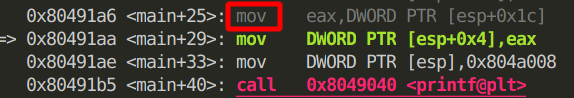
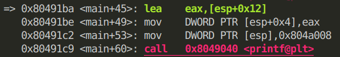
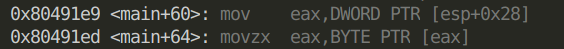
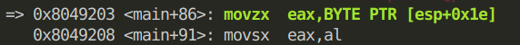

# 指针和数组的关系	

​	对于下面这段代码（完整代码在最后）：

```c
        char *pointer = NULL; 
        char array[10]; 
        pointer = array; 
        printf("%x\n", pointer);
        printf("%x\n", array);
```

​	**我发现对于某个类型的指针和数组是有区别的，即pointer和array是不一样的**	

​	我发现当执行pointer = array后，存储pointer的位置存放的是array的位置，而不是array的值。

​	即它们在栈中是这样的是这样的：

| 内容      | 地址                                |
| :-------- | ----------------------------------- |
| ffffcae2h | esp+1ch == ffffcaceh(pointer的位置) |
| ...       | ...                                 |
| 0000f7feh | esp+12h == fffcae2h (array的位置)   |

​	但是当打印pointer和array的值的时候，却发现它们是一样的。

​	发现在打印pointer的值的时候，汇编指令用的是mov eax, DWORD PTR [esp+ 0x1c]，取的是在pointer位置处的内容，即array的地址。




​	而在打印array的时候，汇编指令用的是lea eax, [esp+0x12]，取的是array的地址。



​	**所以pointer = array做的其实是pointer指向array的地址！**

​	即输出pointer的时候，输出的是它的值，而输出array的时候，输出的是它的地址！


**这段话是错误的：这里pointer看起来充当了指针的指针，array是一个指针，指向一块内存区域，而pointer又指向array。**

array指向的是它自身，从这个角度看，array是一个指针。而pointer就只是一个指针，它指向array数组的内存区域。数组是连续的，数组array的位置和array[0]的位置是一样的。所以我下面这个疑问就自然而然解决了。pointer指向数组的内存区域，[]运算符让pointer可以充当数组的功能。

### 可是pointer[0]却又等于array[0]，这个怎么解释呢？

​	输出pointer[0]时的指令是这样的，修改了程序，完整代码如代码2，将pointer处存的array的地址传给eax，然后再把eax所存内容作为地址再取出对应地址里的内容传给eax，由此得到了pointer[0]



​	输出array[0]时的指令是这样的，将array的地址所存的内容直接传给eax。



​	所以虽然pointer[0]和array[0]是相等的，但是得到它们的步骤不一样，得到pointer[0]时多了一个指向，需要先指向到array数组的地址。


### 那么&array是什么呢？

​	实验证明，&array和array是一样的，都是代表了array的地址。

完整代码1如下：

```c
#include <stdio.h> 
#include <stdlib.h> 
int main( int argc , char *argv[] , char *envp[] ) 
{ 
        char *pointer = NULL; 
        char array[10]; 
        pointer = array; 
        printf("%x\n", pointer);
        printf("%x\n", array);
        strcpy(pointer, argv[1]); 
        printf("Array contains %s at %p\n", pointer, &pointer); 
        strcpy(pointer, argv[2]); 
        printf("Array contains %s at %p\n", pointer, &pointer); 
        
        return 0; 
}   
```

```bash
#编译指令
gcc -m32 -fno-stack-protector -g -o hello hello.c 
```

完整代码2如下（编译指令与上面一样）：

```c
#include <stdio.h> 
#include <stdlib.h> 
void init(int *a) {
        for (int i = 0; i < 9; ++i)
                a[i] = 'a';
}
int main( int argc , char *argv[] , char *envp[] ) 
{ 
        char *pointer = NULL; 
        char array[10]; 
        for (int i = 0; i < 10; ++i)
                array[i] = 'a';
        pointer = array;
        printf("%c\n", pointer[0]);
        printf("%c\n", array[0]);
        //strcpy(pointer, argv[1]); 
        //printf("Array contains %s at %p\n", pointer, &pointer); 
        //strcpy(pointer, argv[2]); 
        //printf("Array contains %s at %p\n", pointer, &pointer); 
        
        return 0; 
}   
```

