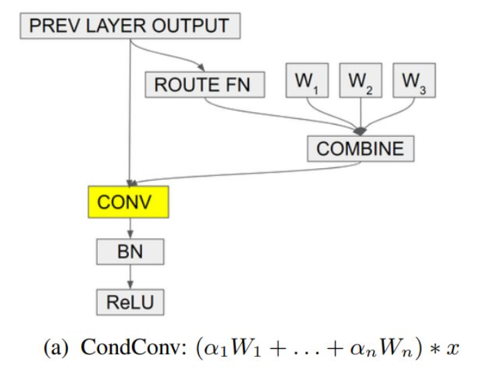

# CondConv

条件参数化卷积：基于输入来动态计算卷积核，从而避免了传统静态的卷积中所有样本共享一个卷积核的缺点。将卷积核参数化为n个专家（卷积核）的线性组合。



## ROUTE_FN

计算注意力值的函数，输入N(num),C(channel),H,W。

```python
class route_func(nn.Module):

    def __init__(self, in_channels, num_experts):
        super().__init__()
        self.avgpool = nn.AdaptiveAvgPool2d(1)
        self.fc = nn.Linear(in_channels, num_experts)
        self.sigmoid = nn.Sigmoid()

    def forward(self, x):
        # 将输入特征全局池化为[N, C, 1, 1]
        x = self.avgpool(x)
        # 将特征转化为[N, C]
        x = x.view(x.size(0), -1)
        # 全连接层将特征转化为[N, K]，也可以通过1X1卷积
        x = self.fc(x)
        # 归一化到[0, 1]区间
        x = self.sigmoid(x)
        return x
```

## CondConv

```python
class CondConv(nn.Module):
    def __init__(self, in_channels, out_channels, kernel_size, stride=1, padding=0, groups=1, bias=False, num_experts=3):
        super(CondConv, self).__init__()
        
        self.in_channels = in_channels
        self.out_channels = out_channels
        self.kernel_size = kernel_size
        self.stride = stride
        self.padding = padding
        self.groups = groups
        self.num_experts = num_experts

        # routing function
        self.routing_func = route_func(in_channels, num_experts)

        self.weight = nn.Parameter(torch.Tensor(num_experts, out_channels, in_channels // groups, kernel_size, kernel_size))
        if bias:
            self.bias = nn.Parameter(torch.Tensor(num_experts, out_channels))
        else:
            self.register_parameter('bias', None)
        nn.init.kaiming_uniform_(self.weight, a=math.sqrt(5))
        if self.bias is not None:
            fan_in, _ = nn.init._calculate_fan_in_and_fan_out(self.weight)
            bound = 1 / math.sqrt(fan_in)
            nn.init.uniform_(self.bias, -bound, bound)

    def forward(self, x):
        routing_weight = self.routing_func(x)
        b, c_in, h, w = x.size()
        k, c_out, c_in, kh, kw = self.weight.size() # k is num_experts
        x = x.view(1, -1, h, w) # 1 x N*C_in x H x W
        weight = self.weight.view(k, -1) # k x C_out*C_in*kH*hW
        combined_weight = torch.mm(routing_weight, weight).view(-1, c_in, kh, kw)

        if self.bias is not None:
            combined_bias = torch.mm(routing_weight, self.bias).view(-1)
            output = F.conv2d(x, weight=combined_weight, bias=combined_bias, 
                            stride=self.stride, padding=self.padding, groups=self.groups * b)
        else:
            output = F.conv2d(x, weight=combined_weight, bias=None, 
                            stride=self.stride, padding=self.padding, groups=self.groups * b)

        output = output.view(b, c_out, output.size(-2), output.size(-1))
        return output

```


