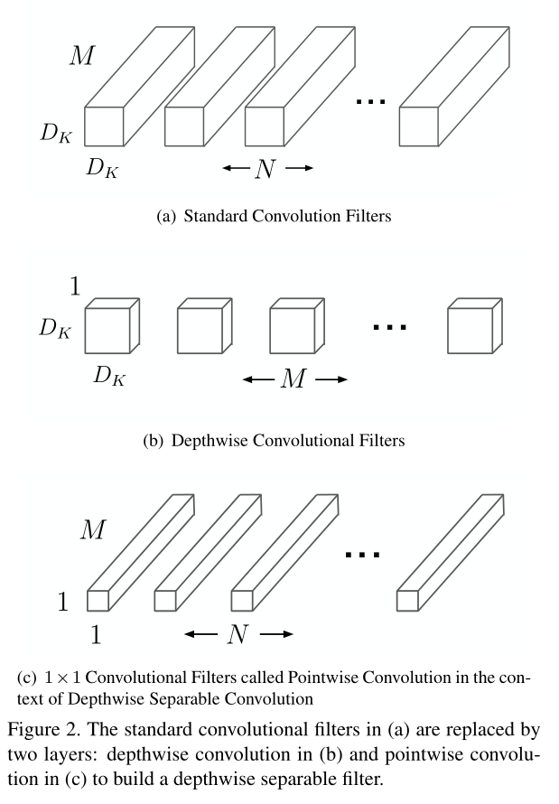
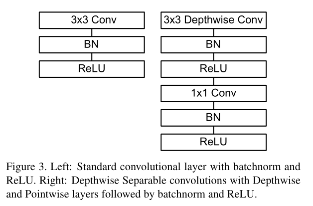
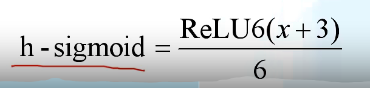
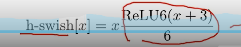

# Mobile Net V1

## Depthwise Separable Convolution

input的channel为M；M个dk * dk * 1卷积核分别与input的1个channel做卷积，产生feature map，然后与N个1 * 1 * M的卷积核做卷积，产生的feature map形状和与N个dk * dk * M的卷积和做卷积一样。

##### 两个超参数

alpha：卷积个数比例，把输入和输出的channel数量m和n减小为a * m和a * n

beta：输入图像尺寸比例，对应的卷积核的size也会缩小到相应比例

##### depthwise conv

##### 每一层的结构：

## Mobile Net V2

##### Inverted Residuals(倒残差结构)

ReLU6激活函数

##### Linear Botttlenecks

## Mobile Net V3

##### SE模块 注意力机制

经过Depthwise Conv之后，池化，两个全连接层，

##### 重新设计耗时层结构

##### 重新设计激活函数

